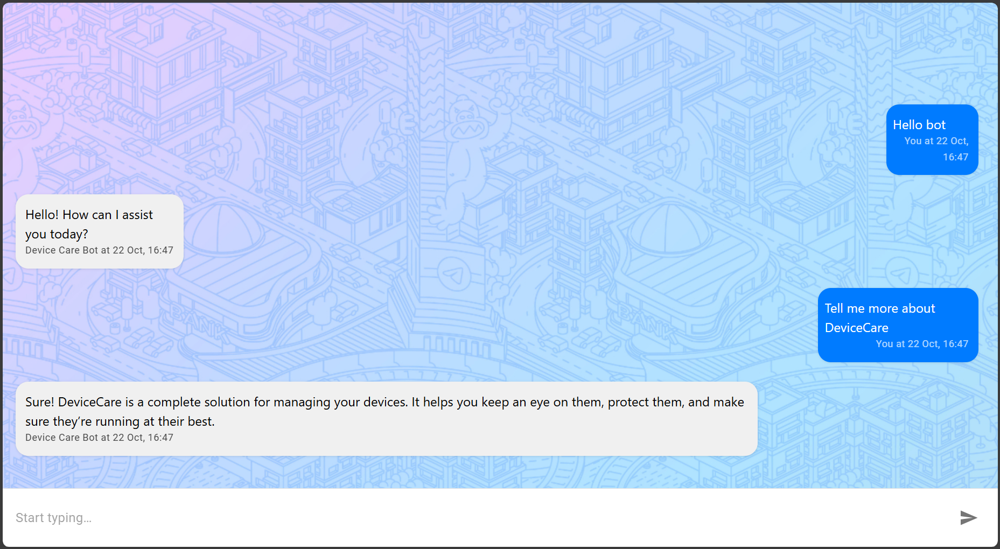

# DeviceCare AI Chatbot

A secure, retrieval-based FAQ chatbot built for **DeviceCare** support. Instead of generating answers freely, this bot matches user queries against a curated knowledge base using **semantic search** — ensuring accurate, brand-safe, and consistent responses.

 

## Features

- **Semantic Query Matching**: Uses OpenAI embeddings + cosine similarity to find the best answer.
- **No Hallucinations**: Only returns pre-approved answers from `faqs.json`.
- **Modern UI**: Clean, responsive chat interface built with React and Material UI.
- **Full-Stack**: 
  - Frontend: React + Vite + TypeScript
  - Backend: Node.js + Express (serves `/api/chat`)

## Tech Stack

- **Frontend**: React 19, TypeScript, Vite, MUI
- **Backend**: Node.js, Express, OpenAI SDK
- **AI**: `text-embedding-3-small` for vectorization, `gpt-4o-mini` for paraphrasing